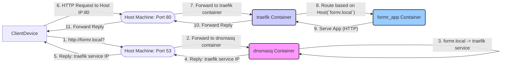

# Plan: Configure formr.local with Dockerized DNS & Reverse Proxy (HTTP Only)

This plan outlines the steps to make `http://formr.local` accessible across the local network using Docker containers for DNS (`dnsmasq`) and a reverse proxy (`traefik`). This avoids the need for client-side certificate installation.

**Goal:** Allow any device on the local network (properly configured for DNS) to access the formr application via `http://formr.local`.

**Strategy:**
*   **DNS:** Use a `dnsmasq` Docker container, configured via `dnsmasq.conf`, to resolve `formr.local`. Network clients/router DHCP must be configured to use the Docker host's IP as their DNS server.
*   **Reverse Proxy:** Use a `traefik` Docker container, configured via `traefik.yml` and Docker labels, to handle incoming HTTP traffic on port 80 and route requests to the `formr_app` container based on the hostname `formr.local`.
*   **Networking:** Use a standard Docker `bridge` network for inter-container communication.

---

## Phase 1: Docker Configuration (Roo Assists)

1.  **Choose DNS Container:** `jpillora/dnsmasq`. (Done)
2.  **Choose Reverse Proxy Container:** `traefik:latest`. (Done)
3.  **Read Existing Config:** Read `docker-compose.yml` and `formr_app/apache/sites-enabled/formr.conf`. (Done)
4.  **Modify `docker-compose.yml`:** (Done)
5.  **Modify Apache Config (`formr.conf`):** (Done - Already simplified for HTTP)
6.  **Create `dnsmasq.conf`:** (Done)
7.  **Modify `traefik.yml`:** (Done - Simplified for HTTP)

## Phase 2: Network Configuration & Deployment (User Tasks)

8.  **Configure Network DNS:**
    *   Determine the local IP address of the host machine running Docker.
    *   Configure your router's DHCP settings (or client devices manually) to use the *host machine's IP address* as the primary DNS server.
9.  **Deploy:** Run `docker-compose up -d --build`.
10. **Test:** From a client machine (with DNS pointing to the host), access `http://formr.local`.

---

## Detailed Configuration Steps (Phase 1 - Completed)

*   **Create `dnsmasq.conf`:** (Done)
    *   Path: `./dnsmasq.conf`
    *   Content: (As created previously)
*   **Modify `traefik.yml`:** (Done)
    *   Path: `./traefik.yml`
    *   Content: (Simplified for HTTP, removed HTTPS entrypoint and TLS section)
*   **Modify `docker-compose.yml`:** (Done)
    *   Replaced `macvlan` network with `bridge` network `formr_bridge_net`.
    *   Added `dnsmasq` service.
    *   Added `traefik` service (port 80 only, no cert volume).
    *   Modified `formr_app` service (no ports, bridge network, HTTP-only Traefik labels).
    *   Modified other services to use `formr_bridge_net`.
*   **Modify `formr_app/apache/sites-enabled/formr.conf`:** (Done)
    *   Simplified to serve only HTTP on port 80 internally.

---

## Diagrams

**Conceptual Flow (HTTP):**



**Plan Overview (HTTP):**

```mermaid
graph TD
    subgraph "Phase 1: Docker Config (Roo - Done)"
        A[1/2. Choose DNS/Proxy Images] --> B(3. Read Configs);
        B --> C(6. Create dnsmasq.conf);
        B --> D(7. Modify traefik.yml for HTTP);
        B --> E(4. Modify docker-compose.yml for HTTP);
        B --> F(5. Modify formr.conf for HTTP);
    end

    subgraph "Phase 2: Network & Deploy (User Tasks)"
        G[8. Configure Network DNS -> Host IP] --> H(9. docker-compose up);
        H --> I(10. Test http://formr.local from clients);
    end

    G --> I; // Client DNS config needed for testing